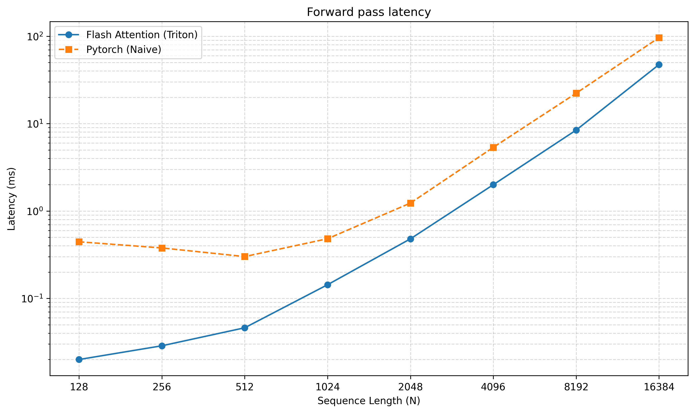
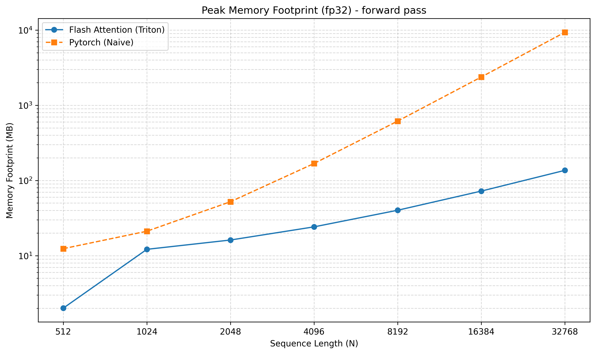

# Flash Attention from Scratch

A high-performance implementation of the [Flash Attention](https://arxiv.org/abs/2205.14135) algorithm using [Triton](https://openai.com/index/triton/), featuring both forward and backward passes with optimized memory access patterns for modern GPUs.

## Core Concepts

Attention is fundamentally memory-bound, with naive implementations requiring O(N²) data transfers between high-bandwidth memory (HBM) and SRAM. This implementation addresses these challenges through three key optimizations:

1. **Tiling**: Partitions Q, K, V matrices into smaller tiles (default: 16x16) to fit in SRAM. This requires implementing an online version of the softmax operation
2. **Kernel Fusion**: Combines multiple operations (matmul, softmax, scaling) into a single GPU kernel
3. **Recomputation**: Avoids storing O(N²) attention matrices by recomputing them during backward pass

## Features

- 🚀 Full PyTorch autograd support
- ⚡ Both forward and backward passes implemented
- 🧠 Configurable tile sizes for different GPU architectures
- 📊 Built-in benchmarking utilities

## Performance

*Benchmarks ran on GeForce RTX 4050 (6GB), CUDA 13.0*

### Latency Scaling (Forward Pass)
The following plot shows the median latency of the forward pass as a function of sequence length, for a fixed embedding dimension of 128, float32 data type and tiling of 16x16.

### Memory Footprint
The following plot shows the peak memory footprint of the forward pass as a function of sequence length, for a fixed embedding dimension of 128, float32 data type and tiling of 16x16.

### Key Insights

- **Paper comparison**: both plots show curve shapes very similar to that presented in the original paper
- **Sub-quadratic Scaling**: Achieves better than O(N²) scaling for memory bandwidth
- **Significant Speedup**: 3-5x faster than naive implementation for sequence lengths > 1K

## Getting Started

### Prerequisites

- Python 3.8+
- PyTorch 2.0+
- Triton 2.0+
- CUDA-compatible GPU

## Future Work

- [ ] benchmark backward pass performance
- [ ] full Triton implementation of the backward pass

## License

